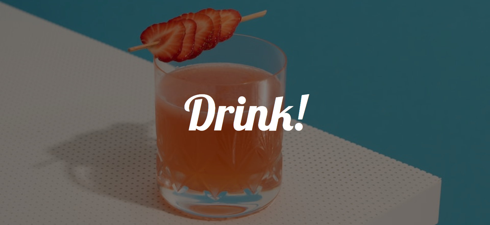
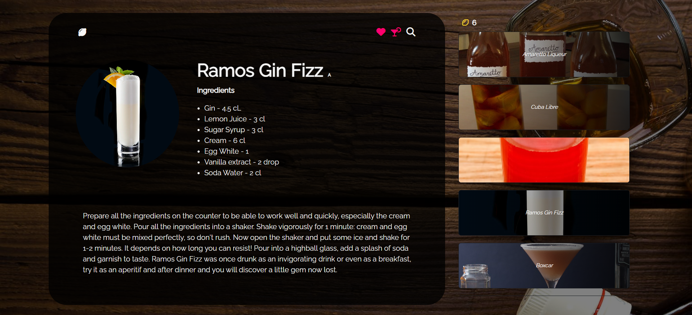
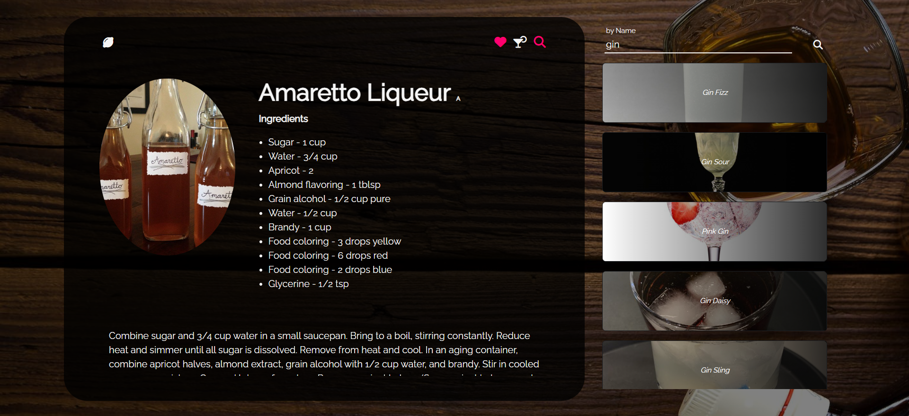

# 랜덤 칵테일 레시피 어플리케이션

사용 API: https://www.thecocktaildb.com/api.php  
사용 stack: http5, django, JavaScript, Axios, lodash, Vue.js  

# 프로젝트 개요 
- Open API를 활용한 칵테일 레시피 생성 사이트
- 진행 기간: 2023.11.01~2023.11.06
- 목표
  - ☑ 로컬 스토리지를 활용한 레시피 저장 기능 추가
  - ☑ 검색 기능 추가
  - ☑ 반응형 페이지 구현
  - 로그인기능 추가하여 서버에 레시피 저장
- 후기: 수업에서 Vue를 배우던 당시 Vue와 django tamplate의 활용을 연습하기 위해 제작된 사이트로, 오직 axios와 JavaScript만을 이용해 제작되었기때문에 기능적인 측면에서나 디자인적인 측면에서나 다소 아쉬움이 남는 프로젝트. 나중에 여유가 된다면 Vue3을 이용하여 전체적으로 개량을 해보고싶다.
- 이미지
  - 메인화면
  
    - drink 클릭 시 사이트 입장
  - 레시피 표시 및 저장
  
    - 레시피 좌측 상단 레몬 그림 클릭 시 랜덤 레시피 생성
    - 레시피 우측 상단 하트 클릭 시 레시피 저장
    - 레시피 우측 상단 칵테일 클릭 시 저장된 레시피 출력
    - 레시피 우측 상단 돋보기 클릭 시 검색화면 출력
  - 레시피 검색
  
    - by Name, by ingreds 토글하여 이름/재료로 검색 가능

#### 231101 UPDATE
---
- 메인페이지 제작
- 칵테일 레시피 랜덤 생성 기능 추가
- 향후 추가하고 싶은 부분: 저장한 레시피를 로컬 데이터베이스에 담기

#### 231102 UPDATE
---
- 로컬 데이터베이스와 저장 기능 구현
- Vue.js를 적용하여 script 및 body 정리
- 향후 추가하고 싶은 부분 및 보완점  
  - 현재 레시피 저장 직후 저장된 레시피 목록을 눌러 레시피를 불러올 수 없는 오류가 있음
  - innerHTML로 Vue의 directive 기능 추가 시 새로고침 할 때까지 적용이 되지 않는 것으로 보인다ㅠㅠ
  

#### 231106 UPDATE
---
- 저장한 레시피 불러오기 기능 추가
- 재료 및 이름으로 검색 기능 추가